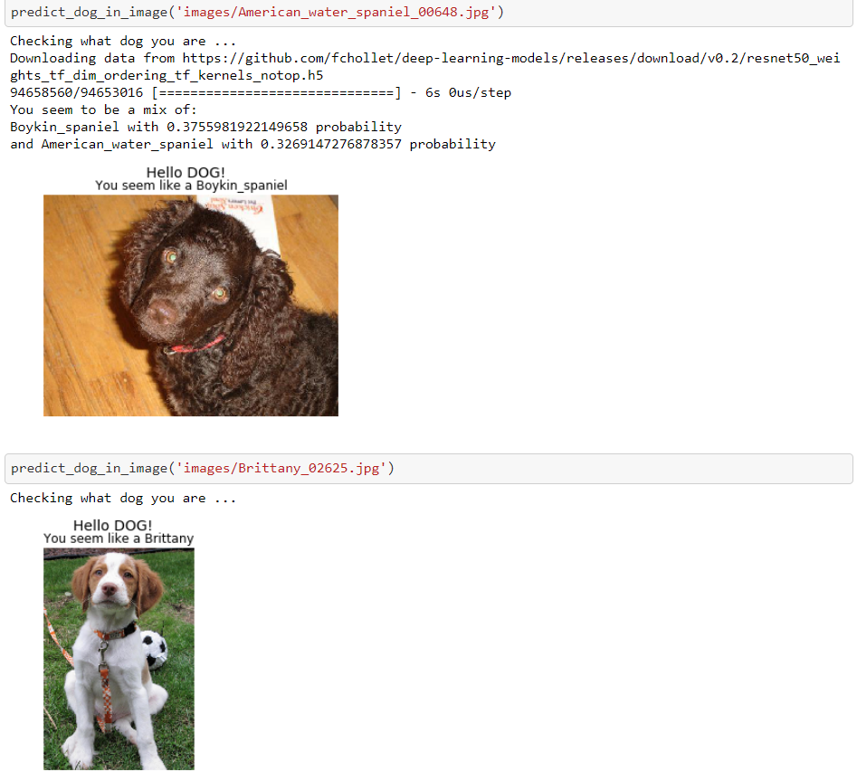
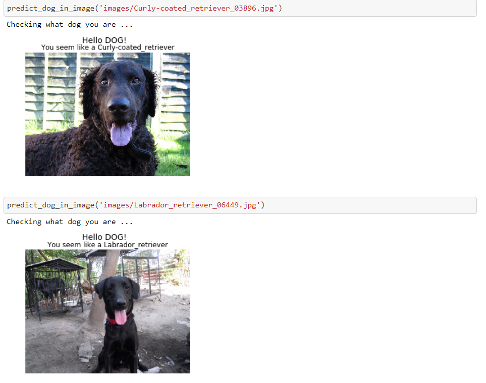
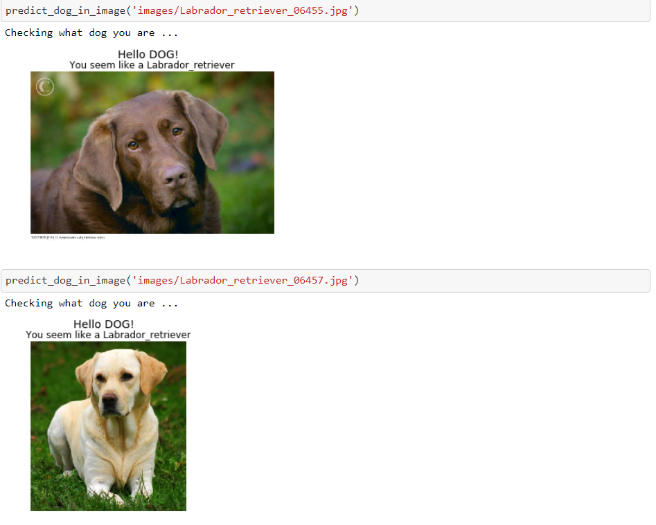
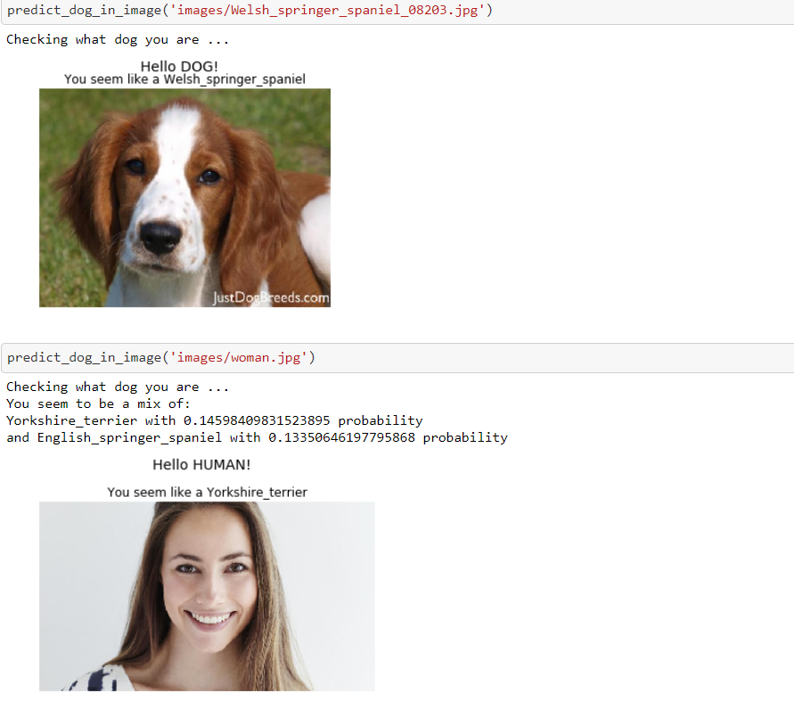
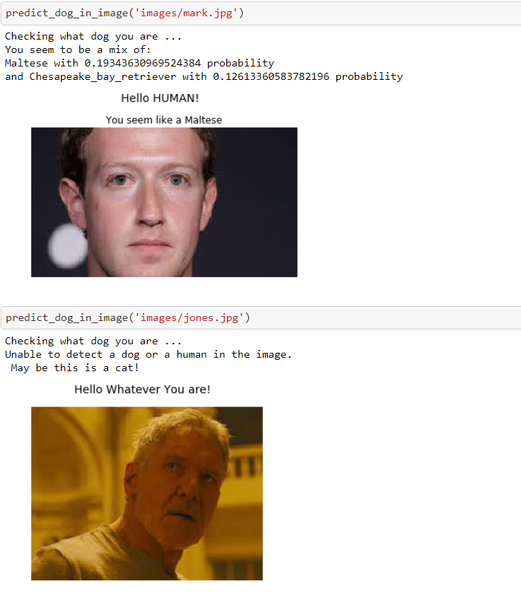

## Project Overview

In this notebook, we will take the first steps towards developing an algorithm that could be used as part of a mobile or web app.  At the end of this project, the code will accept any user-supplied image as input.  If a dog is detected in the image, it will provide an estimate of the dog's breed.

We break the notebook into separate steps:

* **Step 0**: Import Datasets
* **Step 1**: Detect Humans
* **Step 2**: Detect Dogs
* **Step 3**: Create a CNN to Classify Dog Breeds (from Scratch)
* **Step 4**: Use a CNN to Classify Dog Breeds (using Transfer Learning)
* **Step 5**: Create a CNN to Classify Dog Breeds (using Transfer Learning)
* **Step 6**: Write our Algorithm
* **Step 7**: Test our Algorithm

**Note**: 

1. Download the [dog dataset](https://s3-us-west-1.amazonaws.com/udacity-aind/dog-project/dogImages.zip).  Unzip the folder and place it in the repo, at location `path/to/dogImages`. 

2. Download the [human dataset](https://s3-us-west-1.amazonaws.com/udacity-aind/dog-project/lfw.zip).  Unzip the folder and place it in the repo, at location `path/to/lfw`. 

3. Donwload the [VGG-16 bottleneck features](https://s3-us-west-1.amazonaws.com/udacity-aind/dog-project/DogVGG16Data.npz) for the dog dataset.  Place it in the repo, at location `path/to/bottleneck_features`.

## Results

### On the test set with a pretrained resnet50 architecture we get a test accuracy of 82%. 

### On the 10 images (mix of humans and dogs) we input manually, we get 8 correct. Below are the predicted results:

